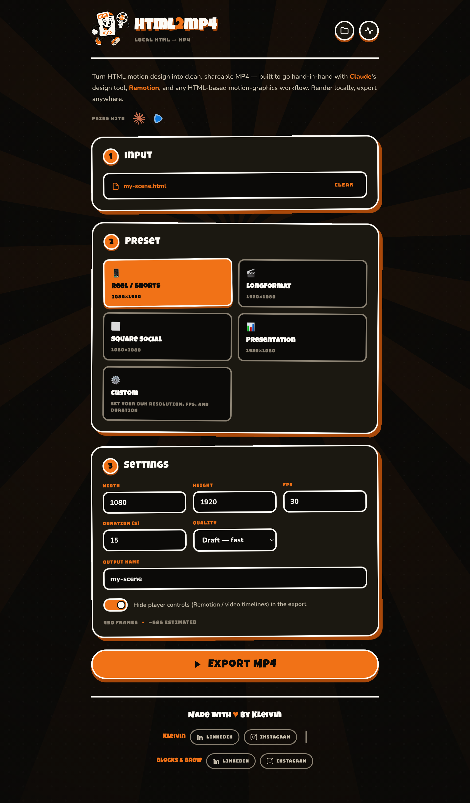
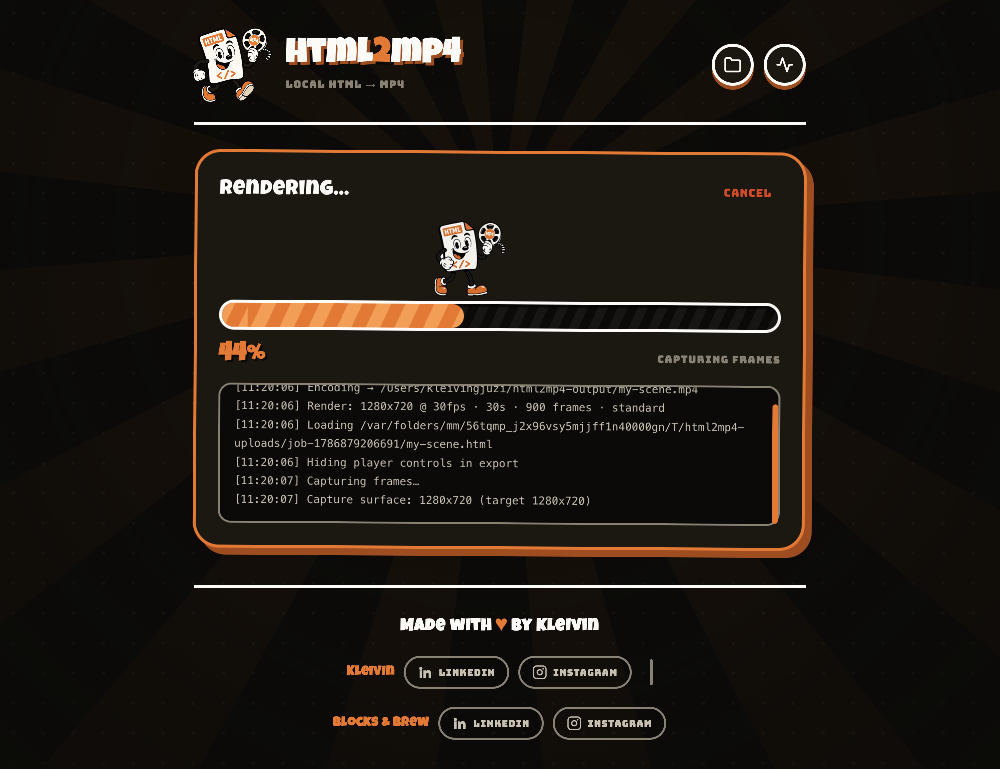

<div align="center">


# html2mp4

**Turn any HTML animation into a clean MP4. Locally. No cloud, no API keys, no accounts.**

[](LICENSE)
[](https://github.com/KleivinX/html2mp4/releases/latest)
[](https://github.com/KleivinX/html2mp4/releases)
[](#download)

</div>

---

Drop in an HTML file — a CSS animation, a Remotion scene, a motion-design
export from Claude, a canvas sketch — and get a smooth, frame-accurate MP4 out
the other side. It's a single standalone desktop app that bundles everything it
needs, so there's nothing to install, sign up for, or upload anywhere.

<div align="center">
  
</div>

## Why it exists

Every other route from HTML to video is annoying. Screen recording gives you
dropped frames and a cursor. Cloud renderers want an account and an upload.
Headless Chrome scripts mean wiring up Puppeteer, FFmpeg and a frame loop
yourself, every single time.

html2mp4 is that pipeline, already wired, in a window.

## Frame-accurate, not screen-recorded

The renderer overrides `requestAnimationFrame`, `performance.now`, `Date.now`
and CSS animation timing, then advances the clock by hand — one tick per frame.
The page never knows it's being rendered slower than real time, so a 30-second
animation at 30 fps produces exactly 900 frames with zero drift, whether your
machine renders it in 20 seconds or three minutes.

```
HTML → Electron's built-in Chromium (offscreen, frozen clock) → frames → FFmpeg → MP4
```

Frames stream straight into FFmpeg as they're captured — no temp directory
full of PNGs. Rendering uses **the Chromium that Electron already ships**: no
Playwright, no second browser download.

## And there's a guy who walks the progress bar

<div align="center">
  
</div>

## Download

Grab the installer for your OS from
[**Releases**](https://github.com/KleivinX/html2mp4/releases/latest), open
it, done — nothing else to install.

| Your computer | Download | Size |
|---|---|---|
| **Mac** with Apple Silicon (M1–M4) | `html2mp4-x.x.x-arm64.dmg` | ~127 MB |
| **Mac** with Intel | `html2mp4-x.x.x-x64.dmg` | ~141 MB |
| **Windows** | `html2mp4-Setup-x.x.x.exe` | ~101 MB |
| **Linux** | `html2mp4-x.x.x.AppImage` | ~135 MB |

Not sure which Mac you have?  → **About This Mac**. If the Chip line says
"Apple M-something", take the `arm64` file; if it says Intel, take `x64`.

> **First launch on macOS.** The app isn't Apple code-signed, so macOS will say
> it can't verify the developer. Right-click the app → **Open** → **Open**
> (once only), or allow it under **System Settings → Privacy & Security**.

## What it handles

CSS animations and transforms · `requestAnimationFrame` · JS-driven
transitions · SVG animation · canvas animation · web fonts · local assets
(images, fonts, scripts) · whole folders with an `index.html`.

## Presets

| Preset | Resolution | FPS | For |
|---|---|---|---|
| Reel / Shorts | 1080×1920 | 30 | Reels, Shorts, TikTok |
| Longformat | 1920×1080 | 30 | YouTube, long-form |
| Square Social | 1080×1080 | 30 | Instagram, LinkedIn |
| Presentation | 1920×1080 | 30 | Slides, demos, walkthroughs |
| Custom | anything | anything | Your call |

Presets only prefill — every field stays editable, and changing one flips you
to **Custom** automatically.

**Hide player controls** (on by default) strips player chrome — Remotion's
player bar, native `<video>` controls, scrubbers and timelines — so it doesn't
get baked into the export.

## Output

H.264 / yuv420p, playable everywhere, with `+faststart` for instant web
playback. Three quality levels: **Draft** (fast), **Standard**, and **High**
(2× supersampled).

## Run from source

Needs **Node.js 18+**.

```bash
git clone https://github.com/KleivinX/html2mp4.git
cd html2mp4
npm install
npm start        # launches the desktop app
npm run doctor   # checks Node, FFmpeg and the renderer
```

Try the files in `samples/` to confirm your setup:
`motion-graphics.html`, `presentation-slides.html`, `instagram-reel.html`,
`canvas-animation.html`.

## Building installers

```bash
npm run dmg:mac      # → dist/html2mp4-x.x.x.dmg
npm run dist:win     # → dist/html2mp4 Setup x.x.x.exe
npm run dist:linux   # → dist/html2mp4-x.x.x.AppImage
```

`dmg:mac` builds the `.app` and wraps it with plain `hdiutil`, which is far
more reliable than electron-builder's own DMG step in restricted and CI
environments.

**Each installer must be built on its own OS.** The easy way to get all three
is the bundled GitHub Actions workflow: push a `v*` tag and it builds all three
and attaches them to a draft release.

```bash
git tag v1.0.0 && git push origin v1.0.0
```

## Project structure

```
html2mp4/
├── electron/
│   ├── main.js                 desktop shell: embeds the server, opens the window
│   ├── electron-renderer.js    offscreen Chromium → frames (capturePage)
│   └── timing-preload.cjs      freezes time in the page for deterministic capture
├── public/                     the whole UI — vanilla HTML/CSS/JS, no framework
│   ├── walker.gif              the mascot's walk cycle, cut from a source MP4
│   └── fonts/                  bundled so the app renders identically offline
├── src/
│   ├── server.js               Express API (the renderer is injected by the shell)
│   ├── encoder.js              streaming FFmpeg encoder
│   ├── presets.js              export presets
│   └── doctor.js               dependency checker
├── samples/                    demo HTML files
├── scripts/make-dmg.sh         reliable dmg builder
└── build/icon.png              app icon
```

One rule worth knowing if you're poking around: **`src/` never imports
Electron.** The shell injects a renderer through
`globalThis.__h2m_createRenderer`, which keeps the server independent of how
frames actually get made.

## Design

1930s rubber-hose cartoon, on purpose. The palette is pulled straight off the
mascot artwork — orange `#F17217`, ink `#0B0A08`, cream `#FDFBF6` — with
Luckiest Guy for display type, Bungee for labels and Nunito for body text.

The progress bar mascot is a 29-frame loop cut out of a source animation, with
the backdrop removed by a flood fill seeded from the frame edges. He rides the
fill edge of the bar as your render advances.

## Contributing

Bug reports and PRs are welcome — see [CONTRIBUTING.md](CONTRIBUTING.md) for
setup, architecture notes and what to check before opening a PR. Everyone
participating is expected to follow the
[Code of Conduct](CODE_OF_CONDUCT.md). For security issues, see
[SECURITY.md](SECURITY.md).

## Licence

Source code is [MIT](LICENSE).

Two caveats worth reading if you plan to redistribute builds:

- The installers bundle an **FFmpeg binary licensed GPL-3.0-or-later**. That
  doesn't change the licence of this source, but it does attach obligations to
  any build you hand to someone else.
- The **mascot, icon and walk cycle are not MIT** — they're © Kleivin Gjuzi,
  usable in html2mp4 builds and forks, not as general-purpose artwork.

Full details, plus font licences and trademark notes, in
[THIRD-PARTY-NOTICES.md](THIRD-PARTY-NOTICES.md).

---

<div align="center">

Made with ♥ by **Kleivin**
&nbsp;·&nbsp;
[LinkedIn](https://www.linkedin.com/in/kleivin-gjuzi-7a7w/)
&nbsp;·&nbsp;
[Instagram](https://www.instagram.com/kleivingjuzi/)

**Blocks & Brew**
&nbsp;·&nbsp;
[LinkedIn](https://www.linkedin.com/company/blocks-brew/)
&nbsp;·&nbsp;
[Instagram](https://www.instagram.com/blocksandbrew/)

<sub>Claude is a trademark of Anthropic PBC. Remotion is a trademark of Remotion GmbH.<br>
html2mp4 is an independent project and is not affiliated with or endorsed by either.</sub>

</div>
